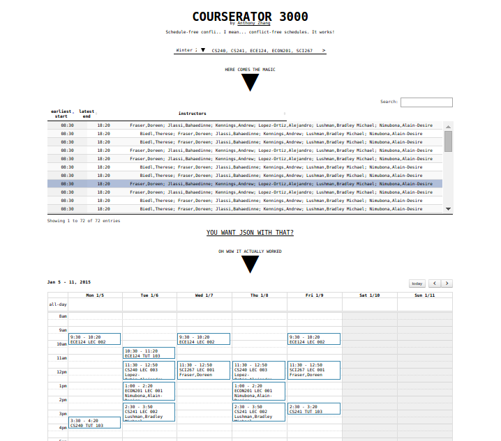
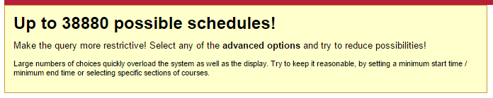

COURSERATOR 3000
================

Dead simple course schedule generator for University of Waterloo courses.

If you've ever used [Waterloo Course Qualifier](http://coursequalifier.com/) and gotten the below error message, this is for you.

By using a powerful constraint solver, this service can handle extremely complex schedules with ease. See the "Implementation notes" section for details.

Using it online
---------------

1. Enter your courses in the provided field as a comma separated list. For example, `CS240, CS241, ECON201, ECE124, SCI267`.
2. The schedules should now be displayed in a table below the entry field. Select a schedule from the list to view it.
3. Selected schedules are displayed below the schedule table.

Hosting it yourself
-------------------

Is the site down? Want to set up your own Courserator instance? Here's how.

Using just Flask:

1. Download [this repository](https://github.com/Uberi/COURSERATOR-3000/archive/master.zip) and extract it somewhere.
2. Make sure Python 3.4 with `pip` is installed. Test this by running `pip3` in the terminal. If it prints out `pip` usage instructions, everything is fine.
3. OPTIONAL: If you are using Windows and want to avoid VS2008 (needed to compile Pycosat), install Pycosat from the included `pycosat-0.6.0.win32-py3.4.exe` installer.
4. Run `build.bat` if using Windows, and `build.sh` otherwise. Wait for it to finish installing the Python packages needed to run this app.
5. RECOMMENDED: Set your own uWaterloo API key for the app by changing `UW_API_KEY` in `uwapi.py`, line 3. You can get a key from [here](http://api.uwaterloo.ca/apikey/). If not specified, a default key is used.
6. Run `__init__.py` to start the server.

Hosting it properly
-------------------

For "real" (production-grade) hosting, we'll be using Apache 2 and Flask over WSGI. These instructions target Ubuntu DigitalOcean Droplets, but should work on any Debain-based system.

Make sure you have all the dependencies:

    sudo apt-get update
    sudo apt-get install python3 python3-pip apache2 libapache2-mod-wsgi-py3

Set up the application in the desired directory (in this case, `/var/www`):

    cd /var/www
    sudo git clone https://github.com/Uberi/COURSERATOR3000.git # if working offline, copy the folder containing this README to `/var/www` instead of using `git clone`
    cd /var/www/COURSERATOR3000/
    sudo bash build.sh
    sudo chmod +x COURSERATOR3000.wsgi # this needs to be executable for Apache to run it

Now to configure Apache to recognize the site, open `/etc/apache2/sites-available/COURSERATOR3000.conf` and give it the following contents:

    <VirtualHost *:80>
        ServerName anthony-zhang.me
        ServerAdmin azhang9@gmail.com
        WSGIScriptAlias / /var/www/COURSERATOR3000/COURSERATOR3000.wsgi
        <Directory /var/www/COURSERATOR3000/COURSERATOR3000/>
            Order allow,deny
            Allow from all
        </Directory>
        ErrorLog ${APACHE_LOG_DIR}/error.log
        LogLevel warn
        CustomLog ${APACHE_LOG_DIR}/access.log combined
    </VirtualHost>

The site can now be enabled:

    sudo a2enmod wsgi
    sudo a2ensite COURSERATOR3000
    sudo service apache2 reload
    sudo service apache2 restart

Done! Now you can monitor it with `tail -f /var/log/apache2/error.log`.

Implementation notes
--------------------

The schedule conflict solver uses [Pycosat](https://pypi.python.org/pypi/pycosat) as a constraint solver to directly calculate schedules with no conflicts. This eliminates a lot of the work in searching for non-conflicting schedules. For example, out of a search space of roughly 38,000 possible schedules in the code examples, we can solve for the 72 possibilities within 5 milliseconds.

Reducing the schedule conflicts to SAT clauses is simple. Let $A_1, \ldots, A_m$ be courses, each with sections ${A_i}_1, \ldots, {A_i}_m$. Then to specify that we want one of the sections of each course, we specify the clause ${A_i}_1 \lor \ldots \lor {A_i}_1$ for each $i$.

To avoid multiple sections of the same course being selected, we specify the clauses $\neg {A_i}_x \lor \neg {A_i}_y$ for each distinct set $\left\{x, y\right\}$, for each $i$. Now we have specified that we want one and only one section from each course.

The conflict detector is responsible for detecting every possible pair of conflicting sections. This means that we run it once over all the sections and obtain a list of conflicting pairs, which is a good thing since its time complexity is pretty bad (but still polynomial). However, in practice it completes quickly enough, helped by the fact that we only need to run it once per query.

The conflict detector outputs pairs $({A_i}_x, {A_j}_y)$, which represent the idea that the section ${A_i}_x$ conflicts with ${A_j}_y$. For each of these pairs, we specify the clause $\neg {A_i}_x \lor \neg {A_j}_y$. Now we have specified that the conflicting sections cannot both be chosen.

Solving for all these clauses using the SAT solver, we obtain solutions of the form ${A_1}_x, \ldots, {A_n}_y$ - a list of course sections that were solved for. These are the conflict-free schedules. The only thing left to do after this is display the results.

Essentially:

1. User requests courses to attempt to schedule.
2. Course data for each course is requested from the [uWaterloo Open Data API](http://api.uwaterloo.ca/), computing the start/end times of each individual block for each section. A simple caching mechanism cuts down on unnecessary requests.
3. Conflicts are detected by looking for overlapping blocks.
4. Constraints are generated from the course sections and conflicts between them.
5. Schedules are solved for using PycoSAT.
6. Schedules are formatted and displayed to the user.

License
-------

Copyright 2014 Anthony Zhang.

This program is licensed under the [GNU Affero General Public License](http://www.gnu.org/licenses/agpl-3.0.html).

Basically, this means everyone is free to use, modify, and distribute the files, as long as these modifications are also licensed the same way.

Most importantly, the Affero variant of the GPL requires you to publish your modifications in source form, even if the program is hosted as a service, without being distributed.
